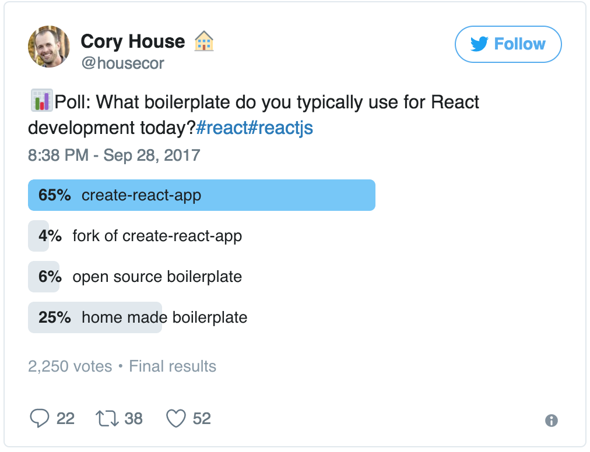
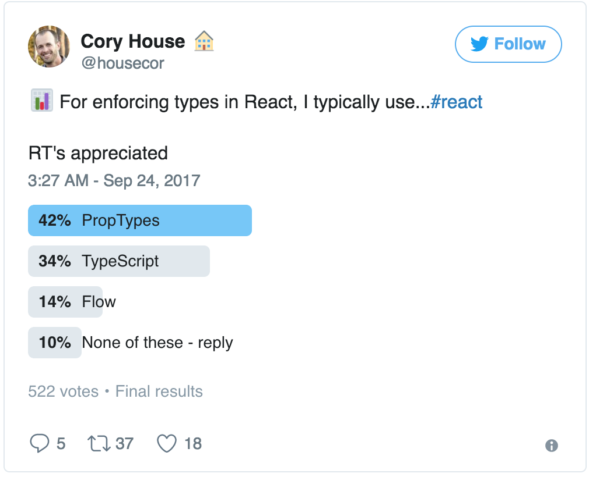
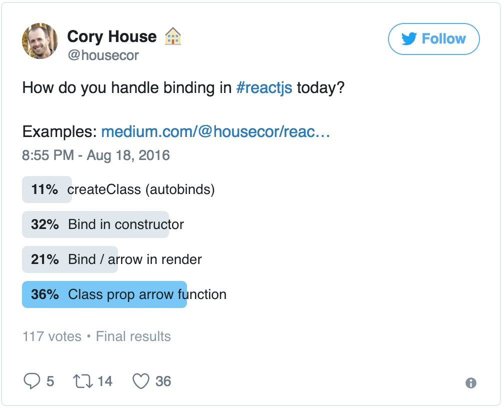
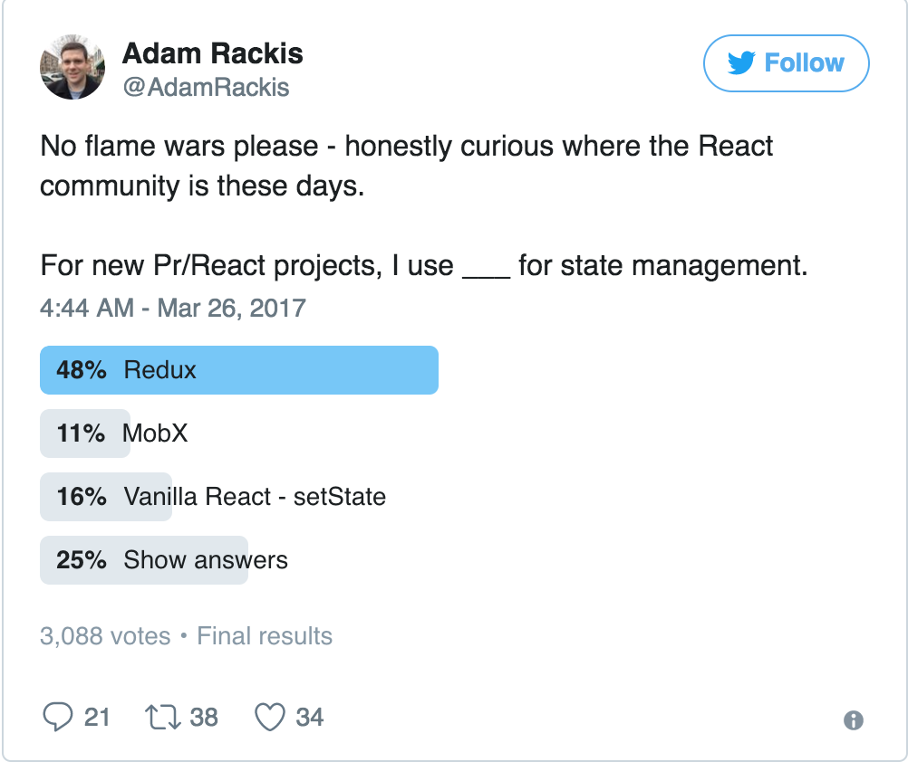
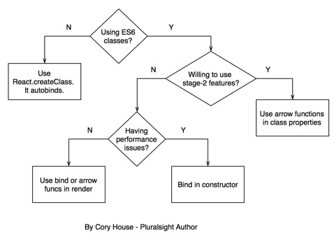
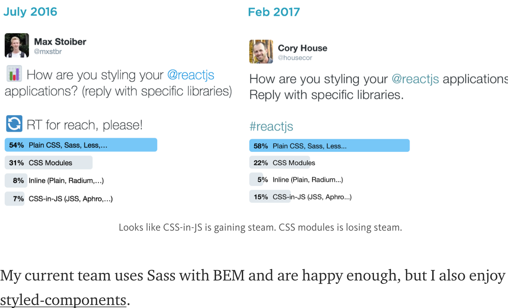

> 在 React 开发的过程中我们常常会遇到一些抉择，下面我将选取其中一些个人认为重要的抉择来一一分析。但请记住以下所说的都只是我的建议，可能有一些反面我也没有考虑到，你还是需要依据实际情况自己选择最合适的，切勿随波逐流。

## 抉择 1：开发环境搭建


通用场景建议使用 [create-react-app](https://github.com/facebookincubator/create-react-app)，它将满足你大部分的开发需求，如果默认配置不能满足你的需求，运行 ```npm run eject``` 按需修改你的配置吧。

其他可替代
- [Gatsby](https://github.com/gatsbyjs/gatsby) 适用于开发静态网站
- [Next.js](https://github.com/zeit/next.js) 适用于前后端同构方案

如果以上皆不能满足你的需求时，亲，自己开发吧。

## 抉择 2：类型

如果你懒得折腾，那 prop-types 可以满足你的类型验证，也会避免大部分的类型BUG。

如果你喜欢折腾，还有下面两种选择：
- [TypeScript](https://github.com/Microsoft/TypeScript) 
- [Flow](https://github.com/facebook/flow) 

## 抉择 3：ES5(createClass) VS ES6(class)

如果你开发环境使用的是ES5语法，那你没得选择只能使用createCalss，[非ES6环境下如何使用React](https://reactjs.org/docs/react-without-es6.html)

如果你开发环境使用ES6语法，强烈建议使用 class，因为这是趋势

## 抉择 4：类 VS 纯函数
如果你不需要使用生命周期，尽可能使用纯函数，他能帮你更好的设计的你组件。

## 抉择 5：State

## 抉择 6：绑定（Binding）
一张图搞定


## 抉择 7：样式（Styling）

## 抉择 8：复用逻辑

## 抉择 9：目录结构
[dss](/images/avatar.jpg)

## 参考文献
[8-key-react-component-decisions](https://medium.com/m/global-identity?redirectUrl=https://medium.freecodecamp.org/8-key-react-component-decisions-cc965db11594)
