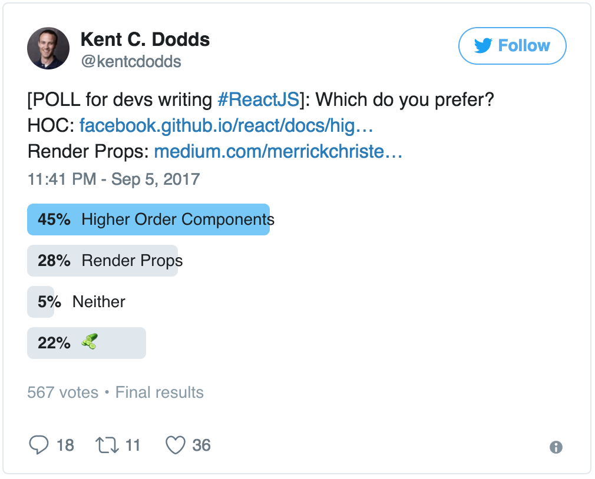

> 在 React 开发的过程中我们常常会遇到一些抉择，下面我将选取其中一些个人认为重要的抉择来一一分析。但请记住以下所说的都只是的建议，可能有一些方面也没有考虑到，大家还是需要依据实际情况自己选择最合适的，切勿随波逐流。

## 抉择 1：开发环境搭建
当开始React开发组件之前，你或你的团队必须先考虑选择什么样的开发环境，先愉快的呈上群众的选择图。


通用场景建议使用 [create-react-app](https://github.com/facebookincubator/create-react-app)，它将满足你大部分的开发需求。如果默认配置不能满足你的需求，运行 ```npm run eject``` 按需修改你的配置吧（温馨提示：此过程式不可回退的）。

其他可替代
- [Gatsby](https://github.com/gatsbyjs/gatsby) 适用于开发静态网站
- [Next.js](https://github.com/zeit/next.js) 适用于前后端同构方案

如果以上皆不能满足你的需求时，亲，自己动手，丰衣足食。

## 抉择 2：类型
JavaScript 是弱类型语言，你可能忽视类型检查，也可能需要引入类型检查。下图是群众的选择图，你将如何选择？


如果你懒得折腾，那 [prop-types](https://reactjs.org/docs/typechecking-with-proptypes.html) 可以满足你的类型验证，也会避免大部分的类型问题。

如果你喜欢折腾，追求完美，没有问题还有下面两种选择：
- [TypeScript](https://github.com/Microsoft/TypeScript) JavaScript 的超集，最终可编译成清晰与整洁的原生JavaScript代码.

- [Flow](https://github.com/facebook/flow) 为 Javascript 添加静态类型检查，用于提高开发者的效率与代码质量。

## 抉择 3：ES5(createClass) VS ES6(class)
如果你开发环境使用的是ES5语法，那你没得选择只能使用createCalss，推荐官方文章《[非ES6环境下如何使用React](https://reactjs.org/docs/react-without-es6.html)》

如果你开发环境使用ES6语法，强烈建议使用 class，使用起来更简单，Facebook 也推荐使用 Class，示例代码如下：

```jsx
  class SayHello extends React.Component {
    constructor(props) {
      super(props);
      this.state = {message: 'Hello!'};
    }
    render() {
      return (
        <p>
          Say: {this.state.message}
        </p>
      );
    }
  }
```

## 抉择 4：类 VS 纯函数
如果你不需要使用生命周期，尽可能使用无状态纯函数（Stateless functional components：react-v0.14版本添加的新特性）。

无状态纯函数简单例子：
```jsx
  // 无状态纯函数组件，使用 ES5 
  var Aquarium = function(props) {
    var fish = getFish(props.species);
    return <Tank>{fish}</Tank>;
  };

  // 无状态纯函数组件，使用 ES2015 (ES6) 箭头函数:
  var Aquarium = (props) => {
    var fish = getFish(props.species);
    return <Tank>{fish}</Tank>;
  };

  // 或者再使用对象解构与默认的返回，简单：
  var Aquarium = ({species}) => (
    <Tank>
      {getFish(species)}
    </Tank>
  );

  // 然后使用: <Aquarium species="rainbowfish" />
```

依据单一职责原则，你的组件应该只有且只一个职责，内部的逻辑尽量设计扁平，如果逻辑复杂那说明你的组件是否要分解，使用纯函数会使你时时刻刻考虑组件的设计是否合理。

总之一句话，纯函数能帮你更好的设计的你组件，底层的原子组件尽量使用纯函数，可复用或者更复杂的逻辑可以考虑抽离出高价逻辑组件。

也并不是说所有地方都要使用纯函数，如果你的组件确实需要状态与生命周期相关操作，那就使用类。

附带两篇同一个作者的不同观点的文章（英文）：
- 使用无状态函数组件的9个理由 [React Stateless Functional Components: Nine Wins You Might Have Overlooked](https://hackernoon.com/react-stateless-functional-components-nine-wins-you-might-have-overlooked-997b0d933dbc)
- 7个不使用无状态纯函数组件的理由 [7 Reasons to Outlaw React’s Functional Components](https://medium.freecodecamp.org/7-reasons-to-outlaw-reacts-functional-components-ff5b5ae09b7c)

## 抉择 5：State
声明，下图只是群众的选择


如果是简单WEB的应用，可能 React 提供的 setState() 就完全能满足你的需求，够用就好别强行加入其它 State 管理框架。

如果是大型的WEB应用，个人建议使用 [Redux](https://github.com/reactjs/redux)。Redux是JavaScript应用程序的可预测状态管理容器。它可以帮助您编写行为一致的应用程序，可在不同环境（WEB客户端，服务器和手机应用等）中运行，并且易于测试。

顺便提一下Redux借鉴的其核心思想之一的框架 [Flux](https://github.com/facebook/flux)，有兴趣可以是研究一下。

[Bobx](https://github.com/mobxjs/mobx)，简单，可扩展的状态管理库。本人也没有使用就不细说了

## 抉择 6：绑定（Binding）
一张图能搞定，就不多做解释了


使用箭头函数绑定示例代码
```jsx
  class SayHello extends React.Component {
    constructor(props) {
      super(props);
      this.state = {message: 'Hello!'};
    }

    // 使用箭头函数banding
    handleClick = () => {
      alert(this.state.message);
    }

    render() {
      return (
        <button onClick={this.handleClick}>
          Say hello
        </button>
      );
    }
  }
```

使用构造函数中绑定示例代码如下：
```jsx
  class SayHello extends React.Component {
    constructor(props) {
      super(props);
      this.state = {message: 'Hello!'};
      
      // 在用构造函数banding
      this.handleClick = this.handleClick.bind(this);
    }

    handleClick() {
      alert(this.state.message);
    }

    render() {
      return (
        <button onClick={this.handleClick}>
          Say hello
        </button>
      );
    }
  }
```

## 抉择 7：样式（Styling）
样式的选择太多了，我们就不一一列举，我们选择几个React开发者常用的选择项，群众的选择尽在下图中


依据群众的选择，好像（由于上图群众的人数不详，样本不能足，只能说好像） CSS-in-JS 正在吞噬 CSS-Modules 的份额。

Cory House 的选择编写代码使用SASS，命名使用BEM已经足够，他也关注 [styled-components](https://github.com/styled-components/styled-components)。

本人倾向逻辑，结构与样式分离，现阶段还是使用SASS，命名使用BEM。近期在探讨更适合自己的样式CSS组织架与命名方式，后续会有专门的文章(《CSS架构解决方案系列》)，本文就不做深入研究了。

下面简单的罗列一下，如何更好的组织样式的解决方案： [OOCSS](https://github.com/stubbornella/oocss/wiki), [SMACSS](https://smacss.com/), [BEM](http://getbem.com/introduction/), [ITCSS](https://www.xfive.co/blog/itcss-scalable-maintainable-css-architecture/),  [ECSS](http://ecss.io/slides2/),  [SUIT CSS](http://suitcss.github.io/), [Atomic Design](http://patternlab.io/), [Atomic](http://github.com/nemophrost/atomic-css)。欢迎补充！

## 抉择 8：复用逻辑
接下来你要面对的是如何复用你的逻辑，编程世界的一句名言“不要重复自己”。默默的看着群众的选择图


高阶组件（Heigher Order Components）, 如果不了解可以阅读下列文章：
- Facebook官方文档英文 [Higher-Order Components](https://reactjs.org/docs/higher-order-components.html)
- 中文阅读 [深入理解 React 高阶组件](https://zhuanlan.zhihu.com/p/24776678?group_id=802649040843051008)

高级组件时现在最流行的方案，但还是需要了解 [render props](https://cdb.reacttraining.com/use-a-render-prop-50de598f11ce)，它比高级组件跟容易阅读与创建。其实我还没有深入理解与实践 render props，无法给出建议，看你自己的选择。

我现在使用的是高级组件，未来也不排除会使用 render props，软件行业不不变的主题就是“变化”，说不定还会有更合理的方案呢？

## 抉择 9：目录结构
你是喜欢所有组件共用一个文件夹呢，如下
```
  src/
  |- App.js
  |- RewarmView.js
  |- RewarmSearchInput.js
  |- RewarmImage.js
  |- RewarmLoading.js
  |- RewarmError.js
  |- giphyLoadData.js
```

还是每个组件有自己的文件夹，基本结构如下
```
  src/
  |- App.js
  |- RewarmSearch/
      |- index.js
      |- View.js
      |- SearchInput.js
      |- Image.js
      |- Loading.js
      |- Error.js
      |- loadData.js
```
收起文件夹，看起来是不是很整洁
```
  src/
  |- App.js
  |- RewarmSearch/
```
每个组件在其单独的文件夹，更详细可阅读
- [Writing Scalable React Apps with the Component Folder Pattern](https://hackernoon.com/the-100-correct-way-to-structure-a-react-app-or-why-theres-no-such-thing-3ede534ef1ed)
- [The 100% correct way to structure a React app (or why there’s no such thing](https://hackernoon.com/the-100-correct-way-to-structure-a-react-app-or-why-theres-no-such-thing-3ede534ef1ed)

个人推荐的是每个组件拥有自己的文件夹，你呢？

## 说在最后
本人虽然有6年前端的开发经验，但文章难免会有遗漏，也可能与你的想法是对立的，欢迎大家提出建议与评论。

## 参考文献
[《 8 key React Component Decisions 》](https://medium.com/m/global-identity?redirectUrl=https://medium.freecodecamp.org/8-key-react-component-decisions-cc965db11594) （本链接需要翻墙）
